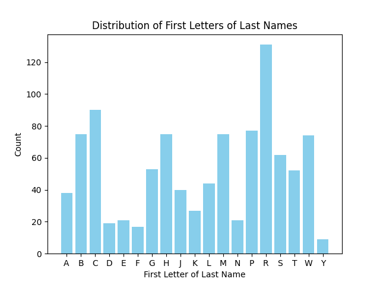

 # DivideNamesIntoEvenGroups

This project divides a list of names into even groups based on the first letter of the last name.

The partitioning logic now uses a **bucket variance score** that represents how evenly distributed the partitions are,
and a **spread score** that represents how wide the partitions are.  It optimized these two scores to pick the best 
partitions for the data provided.

The first commit start by plotting the test data chatGPT generate for us to make sure it's diverse enough.
That is done by visualizing the distribution of the first letters of the last names using a bar chart.

The prompt provided to ChatGPT to generate the data file is as follows:
``````
Generate a CSV file with 1000 random name entries that reflect the diverse population of Denver, Colorado. Each entry should include a first name, last name, gender, and age. The following conditions must be met:

	1.	The first names should include a mix of common male and female names, with approximately 100 different names for each gender.  The names should reflect a diverse population including Anglo, Hispanic, African American and Asian names.
	2.	There should be at least 500 different last names, reflecting a diverse population. These last names should include Anglo, Hispanic, African American, and Asian names, such as: Smith, Garcia, Nguyen, Kim, Ali, etc.
	3.	Gender should be randomly assigned as “Male” or “Female.”
	4.	Each person should be assigned a random age between 4 and 65.
	5.	The file should be named random_names_with_age_diverse_100.csv and contain the following columns: “First Name”, “Last Name”, “Gender”, and “Age”.
``````


## Requirements

- Python 3.x
- pandas
- numpy
- matplotlib

## Usage

1. Place your CSV file (`random_names_with_age_diverse_100.csv`) in the project directory.

2. Run the script:
    ```sh
    python assess_dataset.py
    ```

3. The script will read the CSV file, process the data, and display a bar chart showing the distribution of the first letters of the last names.

## Logging

Logs are stored in the `logs/` directory. Each run generates a new log file with the current timestamp.

## Example

Here is an example of the bar chart generated:



## License

This project is licensed under the MIT License.
