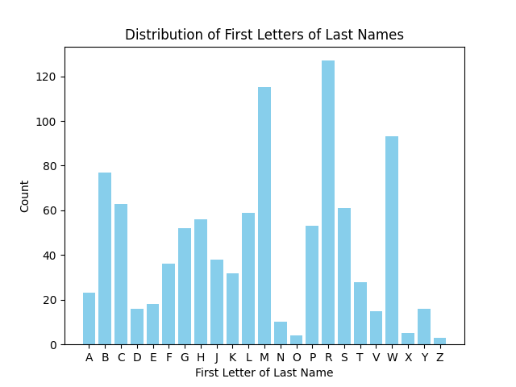

# DivideNamesIntoEvenGroups

This project divides a list of names into even groups based on the first letter of the last name.

The partitioning logic now uses a **bucket variance score** that represents how evenly distributed the partitions are, and a **spread score** that represents how wide the partitions are. It optimizes these two scores to pick the best partitions for the data provided.

## Features

- **Single Partition Support**: Handles cases with zero boundaries.
- **Score Optimization**: Finds the best partitions based on bucket variance and spread scores.
- **Logging**: Logs the partitioning process and results to a file.
- **Extensive testing**: Includes unit tests for all functions.
- **Tested with large datasets**: Handles large datasets with thousands of records.
- ***Unused Experimental Recursive Partitioning***: Supports partitioning with `n` levels of depth.

## Requirements

- Python 3.x
- pandas
- numpy
- matplotlib

## Usage

1. Place your CSV file (`random_names_with_age_diverse_100.csv`) in the project directory.

2. Run the script:
    ```sh
    python assess_dataset.py
    ```

3. The script will read the CSV file, process the data, and display a bar chart showing the distribution of the first letters of the last names.

## Example

Here is an example of the bar chart generated:



## Logging

Logs are stored in the `logs/` directory. Each run generates a new log file with the current timestamp.

## License

This project is licensed under the MIT License.